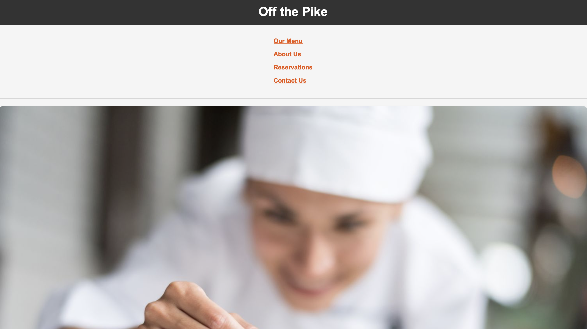

# Reservations Reflection Journal

## Website & Repository

- **Website Homepage:** [Restaurant Homepage](https://vitalune.github.io/reservations/homepage.html)
- **Repository:** [Reservations Repo](https://github.com/vitalune/reservations)

## Screenshots

## Form Description

For the main reservations page, I created the booking form which utilized:
- **Request Method:** `post`
- **Input Types:** `text`, `tel`, `email`, `date`, `time`, and `select`

## Reflecion on Development Process

The overall development process was mostly straightforward. Since my partner and I were each responsible for separate pages, we effectively minimized unintentional overlaps in our work. The only hiccup we encountered was with the styling: sometimes elements (like those with `class="header"`) were unintentionally affected because we forgot to assign the proper IDs, leading to style alterations across all files.

**Collaboration Insights:**
- **Pulling and Merging:** This was very straightforward and hassle-free, largely due to our small team size.
- **Branch-based Development:** Although it felt unnecessary for a project of this scale, I recognize its value in larger projects with more team members.
